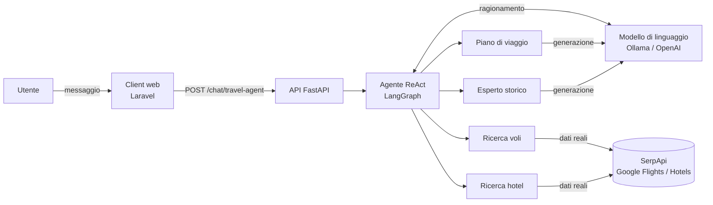

# Travel Agent API

Un assistente di viaggio conversazionale basato su un **agente AI**. Riceve richieste in linguaggio naturale ("vorrei andare a Parigi a novembre"), decide in autonomia quali strumenti usare e risponde con informazioni concrete: voli, hotel, itinerari e approfondimenti storico-culturali.

Il servizio è un'API sviluppata in **Python** con **FastAPI**, **LangChain** e **LangGraph**. Un client web in Laravel (`web_TravelAgent`) fornisce l'interfaccia di chat.

---

## L'idea

Un chatbot tradizionale si limita a generare testo. Un **agente**, invece, ragiona sulla richiesta e può *agire*: interroga servizi esterni, raccoglie dati reali e solo dopo formula la risposta.

L'agente segue il paradigma **ReAct** (*Reason + Act*):

1. **Ragiona** sulla richiesta dell'utente.
2. **Sceglie** lo strumento più adatto (o nessuno, se può rispondere da solo).
3. **Osserva** il risultato restituito dallo strumento.
4. **Ripete** il ciclo finché non ha abbastanza informazioni, poi risponde.



---

## Gli strumenti dell'agente

| Strumento | Cosa fa | Fonte |
|---|---|---|
| `flights_finder` | Cerca voli andata/ritorno tra due aeroporti | SerpApi (Google Flights) |
| `hotels_finder` | Cerca hotel per località, date, ospiti e categoria | SerpApi (Google Hotels) |
| `chain_travel_plan` | Genera un itinerario giorno per giorno (mattina, pomeriggio, sera) | Modello di linguaggio |
| `chain_historical_expert` | Racconta storia e cultura di un luogo | Modello di linguaggio |

L'agente sceglie lo strumento leggendo la **descrizione** e lo **schema degli argomenti** di ciascuno: per questo nomi, descrizioni e campi sono parte integrante della logica, non semplice documentazione.

---

## Architettura

```
travel-agent-api/
├── travel_agent_api/
│   ├── main.py                  # Applicazione FastAPI, CORS, registrazione delle route
│   ├── llm.py                   # Scelta del modello di linguaggio (Ollama o OpenAI)
│   ├── routes/
│   │   └── chat_router.py       # Endpoint POST /chat/travel-agent
│   ├── services/
│   │   └── agent_service.py     # Agente ReAct, system prompt, gestione della conversazione
│   └── tools/
│       ├── flights_finder.py
│       ├── hotels_finder.py
│       ├── chain_travel_plan.py
│       └── chain_historical_expert.py
├── tests/                       # Test automatici (pytest)
├── .env.example                 # Modello della configurazione
└── pyproject.toml               # Dipendenze (Poetry)
```

Il codice è organizzato in livelli con responsabilità separate:

- **Route**: riceve la richiesta HTTP, la valida e restituisce la risposta.
- **Servizio**: costruisce l'agente, il contesto e le regole di comportamento.
- **Strumenti**: ognuno svolge un solo compito ed è indipendente dagli altri.
- **Modello**: un unico punto di configurazione, così il resto del codice non dipende dal fornitore.

### Il ciclo di una richiesta

1. Il client invia l'**intera conversazione** (l'API è *stateless*: non conserva memoria tra una richiesta e l'altra).
2. Il servizio aggiunge un **system prompt** con il ruolo dell'agente, la data corrente, le regole e gli esempi di formato.
3. L'agente esegue il ciclo ReAct, chiamando zero o più strumenti.
4. L'API restituisce la conversazione aggiornata; il client mostra le risposte dell'agente.

---

## Scelte progettuali

Rispetto all'impostazione di partenza, il progetto introduce alcune modifiche, nate dai test e dall'uso di modelli eseguiti in locale.

**Modello di linguaggio intercambiabile.** Il modello si sceglie dal file `.env`: un modello locale tramite **Ollama** (gratuito, nessun dato inviato all'esterno) oppure **OpenAI**. Il resto del codice non cambia.

**Dati reali, mai inventati.** Il system prompt distingue in modo esplicito gli *esempi di formato* dai *dati*: prezzi, orari e nomi di hotel devono provenire solo dagli strumenti. In caso di errore, l'agente lo comunica invece di riempire i vuoti.

**Risultati essenziali.** Le risposte di SerpApi sono molto voluminose (loghi, metadati, token). Gli strumenti estraggono solo i campi utili e pre-elaborano i dati (prezzi ordinati, durate già convertite in ore e minuti), così il modello non deve fare calcoli soggetti a errore.

**Schemi degli argomenti piatti.** Gli argomenti degli strumenti sono campi diretti, non oggetti annidati: i modelli più piccoli li compilano in modo molto più affidabile.

**Output strutturato garantito.** Il piano di viaggio usa l'output strutturato del modello, che vincola la risposta allo schema previsto invece di affidarsi al parsing di testo libero.

**Contesto sotto controllo.** Ogni chiamata ha un limite di token generati, e i risultati degli strumenti dei turni precedenti vengono abbreviati: le conversazioni lunghe restano entro la finestra di contesto del modello.

**Campi opzionali con valori predefiniti.** Le informazioni che l'utente spesso non specifica (restrizioni alimentari, stile di viaggio, attività) hanno un valore predefinito: una richiesta incompleta non fa fallire la chiamata allo strumento.

### Riepilogo delle modifiche rispetto alla guida

| Area | Guida di partenza | Versione realizzata |
|---|---|---|
| Modello | Solo OpenAI `gpt-4o` | Configurabile: Ollama (locale) o OpenAI, in `llm.py` |
| Import | `langchain.prompts` | `langchain_core.prompts` (compatibile con LangChain 1.x) |
| Python | `>=3.9` | `>=3.10`, richiesto dalle versioni attuali delle librerie |
| Schemi dei tool | Argomento annidato `params` | Argomenti piatti |
| Output SerpApi | Risposta completa | Solo campi utili, ordinati e pre-elaborati |
| Voli | Template con volo di ritorno | Andata + prezzo complessivo + link per il ritorno |
| Piano di viaggio | `PydanticOutputParser` senza istruzioni di formato | `with_structured_output` |
| Esperto storico | Restituisce l'oggetto messaggio | Restituisce il testo, risposta concisa |
| System prompt | Ruolo + esempi | Aggiunte regole contro i dati inventati e le ricerche ripetute |
| Conversazione | Cronologia completa | Risultati dei tool precedenti abbreviati |
| Errori | Non gestiti nell'endpoint | Risposta `400` per richieste vuote, `500` con dettaglio |
| Console Windows | — | Output UTF-8 senza buffer (emoji e log in tempo reale) |

Sul client web è stata applicata una sola modifica: `set_time_limit(150)` in `app/Livewire/Chatbot.php`, perché il limite predefinito di PHP (30 secondi) interrompeva le richieste prima del timeout HTTP previsto (120 secondi).

---

## Tracing

Ogni componente stampa nel terminale dell'API cosa sta facendo. Una richiesta tipica produce un log come questo:

```
********************************************************************************
chat_completion
messaggi ricevuti: 1
ultimo messaggio: Cerco un hotel 4 stelle nel centro di Roma per due adulti dal 15 al 20 novembre 2026.
********************************************************************************
LLM: ollama / qwen3:8b
Agent inizializzato - tool disponibili: ['chain_historical_expert', 'flights_finder', 'hotels_finder', 'chain_travel_plan']
********************************************************************************
hotels_finder
parametri: q='Roma' check_in_date='2026-11-15' check_out_date='2026-11-20' adults=2 children=0 hotel_class=4
********************************************************************************
Agent.run - nuovi messaggi: 3
tool chiamato: hotels_finder {...}
********************************************************************************
chat_completion - messaggi restituiti: 4
```

Il log permette di vedere quale strumento l'agente ha scelto, con quali parametri e quante volte: è stato lo strumento principale per individuare e correggere i comportamenti indesiderati descritti sopra.

---

## Avvio

### Requisiti

- Python 3.10+ e [Poetry](https://python-poetry.org)
- Una chiave [SerpApi](https://serpapi.com) (piano gratuito disponibile)
- Un modello di linguaggio: [Ollama](https://ollama.com) con un modello che supporti i tool (es. `qwen3:8b`), **oppure** una chiave OpenAI

### Installazione

```bash
poetry install
cp .env.example .env      # poi inserire le proprie chiavi nel file .env
```

### Configurazione (`.env`)

| Variabile | Descrizione |
|---|---|
| `LLM_PROVIDER` | `ollama` (locale) oppure `openai` |
| `OLLAMA_MODEL` | Modello Ollama da usare, es. `qwen3:8b` |
| `OLLAMA_NUM_CTX` | Finestra di contesto in token (es. `8192`) |
| `OPENAI_API_KEY` | Necessaria solo con `LLM_PROVIDER=openai` |
| `SERPAPI_API_KEY` | Chiave per la ricerca di voli e hotel |

### Esecuzione

```bash
poetry run uvicorn travel_agent_api.main:app --port 8080
```

- Documentazione interattiva: <http://127.0.0.1:8080/docs>
- Client web: avviare `web_TravelAgent` (`php artisan serve`) e aprire <http://localhost:8000>

### Esempio di chiamata

```bash
curl -X POST http://127.0.0.1:8080/chat/travel-agent \
  -H "Content-Type: application/json" \
  -d '{"messages": [{"role": "user", "content": "Cerco un hotel 4 stelle a Roma dal 15 al 20 novembre per due adulti"}]}'
```

### Test

```bash
poetry run pytest
```

I test non richiedono connessione né modello di linguaggio: verificano l'elaborazione dei risultati di voli e hotel, la forma degli schemi degli strumenti, la compattazione della cronologia e il comportamento degli endpoint (con un agente simulato).

---

## Esempi di richieste

- *"Raccontami la storia del Rinascimento a Firenze e il ruolo dei Medici."*
- *"Cerco voli da FCO a CDG per due adulti, dal 12 al 16 novembre."*
- *"Mi servono hotel a Firenze per 2 adulti e 2 bambini, preferibilmente 3 stelle."*
- *"Organizza un viaggio a Venezia di 4 giorni per una coppia, focus su arte e cucina, budget 1500 €."*

---

## Limiti noti

- I modelli locali di piccole dimensioni possono commettere imprecisioni nei contenuti storico-culturali; un modello più grande migliora l'accuratezza.
- SerpApi restituisce i voli di andata con il prezzo complessivo: il volo di ritorno si seleziona dal link a Google Flights.
- I tempi di risposta dipendono dall'hardware quando si usa un modello locale.

## Tecnologie

FastAPI · LangChain · LangGraph · Ollama · OpenAI · SerpApi · Pydantic · Poetry
